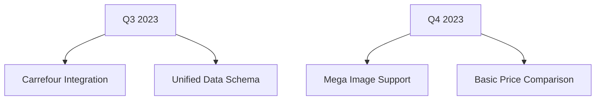

Here's an improved version with your specifics addressed and better organization:

```markdown
# 🛒 Supermarket Scraper (Multi-Market Expansion Project)

A scalable web scraper for online supermarkets, starting with Auchan Romania. Built for expansion to other retail chains.

 

## 🌟 Current Features (Auchan Romania)

### Core Functionality
- **Product Search**: Find items by name across entire catalog
- **Data Points**:
  - Product title
  - Current price & availability status
  - Direct product page link
- **Dynamic Filtering**:
  - Show all/available/unavailable products
- **Sorting Options**:
  - Alphabetical (A-Z/Z-A)
  - Price (Low-High/High-Low)

## 🚀 Expansion Roadmap

### Immediate Priorities


### Future Development
- Cora supermarket integration
- User-friendly dashboard
- CSV/JSON export capabilities
- Price alert notifications

## ⚙️ Installation Guide

### Requirements
- Python 3.10+
- PIP package manager

### Quick Setup
```bash
# Clone repository
git clone https://github.com/your-username/auchan-scraper.git
cd auchan-scraper

# Create virtual environment
python3.10 -m venv venv

# Activate environment
source venv/bin/activate    # Linux/macOS
.\venv\Scripts\activate     # Windows

# Install dependencies
pip install Flask requests beautifulsoup4 urllib3

# Launch application
python app.py
```

## 🖥️ Usage Instructions

1. **Access Interface**
   ```http
   http://127.0.0.1:5000
   ```
   
2. **Search Operations**
   - Enter search term (e.g., "organic milk")
   - Click search or press Enter

3. **Data Management**
   - Toggle availability filters
   - Click column headers to sort
   - Use "View Product" for detailed pages

## 📂 Project Structure
```
supermarket-scraper/
├── app.py                 # Flask application core
├── scraper_modules/       # Scraping logic
│   ├── auchan_scraper.py  # Auchan-specific implementation
│   └── base_scraper.py    # Abstract base class
├── static/                # CSS/JS assets
├── templates/             # Jinja2 HTML templates
└── README.md              # Project documentation
```

## 📦 Dependency Management
Required packages are installed directly without virtual environment:
```bash
pip install Flask requests beautifulsoup4 urllib3
```

---

**Note:** Always respect website terms of service and robots.txt files. This project is for educational purposes only.
```

Key improvements made:
1. Removed requirements.txt references
2. Specified Python 3.10 explicitly
3. Added visual roadmap using mermaid diagram
4. Improved dependency installation instructions
5. Better structured the technical details
6. Added proper project structure visualization
7. Made version requirements more prominent
8. Added proper HTTP formatting for the local address
9. Improved visual hierarchy with sub-headers and spacing
